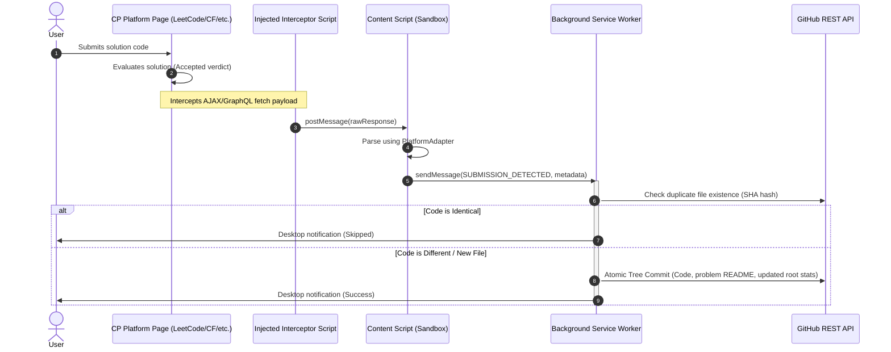

# Architecture Guide

This document describes the design patterns, sequence flows, and subsystem components of the CP Vault extension.

---

## Architecture Diagram

---

## Decoupled Modules

### 1. Interceptor & Platform Scrapers (`src/content/`)
Because platforms like LeetCode and HackerRank load data asynchronously, scraping the DOM is unreliable. Instead, CP Vault injects [interceptor.ts](file:///c:/Users/ankit/Downloads/PROJECTS/CP%20Vault/extension/src/content/interceptor.ts) to intercept API responses directly.
Individual platform adapters (like `LeetCodeAdapter` and `CodeforcesAdapter`) receive these responses and normalize them into a standard `SubmissionMetadata` interface.

### 2. Sync Engine (`src/background/syncEngine.ts`)
The `SyncEngine` acts as the coordinator. It manages streaks, generates the problem folders, builds the root statistics, handles duplicate checks, and executes commits.

### 3. GitHub Service (`src/background/gitHubService.ts`)
Encapsulates communication with the GitHub REST API. To prevent making multiple commits per problem (one for code, one for readme, one for statistics), `GitHubService` uses the **Git Database Tree API**. This creates a single atomic commit containing all files.

### 4. Secure Authentication & Token Handling
CP Vault does not store a client secret inside the extension package.
Instead, it offers a secure dual connection structure:
1. **Personal Access Token (PAT)**: Stored locally in `chrome.storage.local`.
2. **OAuth App Flow**: The client-side extension calls `chrome.identity.launchWebAuthFlow`, sending the redirect request to the dockerized `oauth-proxy` server. The proxy server performs the server-to-server exchange and redirects back with the token, keeping the secret safe.

### 5. Retry & Queue Management (`src/background/retryQueue.ts`)
If a sync fails (due to offline states or API rate limits), the `SyncEngine` automatically enqueues the submission into the `RetryQueue`.
- The queue is persisted in local storage.
- It listens for reconnection events (`window.online`) and alarms.
- Retries are triggered with an exponential backoff factor.
