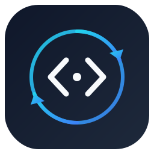

<div align="center">



# CP Vault

### Automatically sync your accepted competitive programming solutions to GitHub — beautifully.

[](https://github.com/ankitpaul6201/CP-VAULT/releases)
[](./LICENSE)
[](https://github.com/ankitpaul6201/CP-VAULT)
[](./extension/manifest.json)
[](https://www.typescriptlang.org/)
[](https://react.dev/)
[](https://github.com/ankitpaul6201/CP-VAULT/stargazers)
[](https://github.com/ankitpaul6201/CP-VAULT/network/members)
[](https://github.com/ankitpaul6201/CP-VAULT/issues)

<br />

**[✨ Features](#-features) · [📦 Installation](#-installation) · [🚀 Usage](#-usage) · [🗺️ Roadmap](#%EF%B8%8F-roadmap) · [🤝 Contributing](#-contributing)**

</div>

---

## 🧠 About

**CP Vault** is a **Manifest V3 Chrome extension** that acts as your personal competitive programming archivist. Every time you solve a problem on a supported platform and get **Accepted**, CP Vault automatically:

- 📁 **Organizes** your solution into a clean folder structure
- 📝 **Generates** a beautiful per-problem `README.md` with metadata
- 📊 **Updates** your repository's root `README.md` with statistics
- 🔄 **Commits & pushes** everything to your GitHub repository — **atomically**, in one single commit

> No copy-pasting. No forgetting to push. Your solutions are always safe, organized, and beautifully documented.

### Why CP Vault?

| Problem | CP Vault Solution |
|---|---|
| You solve 500+ problems but they're scattered | Automatic, organized folder structure |
| You forget to push solutions to GitHub | Every accepted solution is auto-synced |
| Your repository has no documentation | Auto-generated README per problem + root stats |
| Duplicate solutions waste commits | Smart duplicate detection via content hashing |
| You solve on multiple platforms | Unified sync for LeetCode, Codeforces, CodeChef, HackerRank |

### Who is it for?

- 🎓 **Students** building a competitive programming portfolio
- 💼 **Job seekers** showcasing problem-solving skills on GitHub
- 🏆 **Competitive programmers** who want to track their journey
- 👨‍💻 **Developers** who believe in keeping everything version-controlled

---

## ✨ Features

<table>
<tr>
<td width="50%">

### 🔄 Automatic GitHub Sync
Accepted solution? CP Vault instantly syncs it to your GitHub repository using atomic commits — no manual steps, no interruptions to your flow.

</td>
<td width="50%">

### 🌐 Multi-Platform Support
Supports LeetCode, Codeforces, CodeChef, and HackerRank out of the box. More platforms coming soon.

</td>
</tr>
<tr>
<td width="50%">

### 📝 Auto README Generation
Every problem gets a beautiful `README.md` with problem title, difficulty, platform, language, approach notes, and complexity analysis placeholders.

</td>
<td width="50%">

### 📁 Smart Folder Organization
Solutions are organized into `Platform/Difficulty/ProblemID - Name/` — a clean, navigable structure across thousands of problems.

</td>
</tr>
<tr>
<td width="50%">

### 🔐 GitHub OAuth
Secure OAuth 2.0 authentication. Your token is stored locally in Chrome storage — never on any external server.

</td>
<td width="50%">

### 🧮 Duplicate Detection
Content-based hashing ensures identical solutions are never re-uploaded, keeping your commit history clean.

</td>
</tr>
<tr>
<td width="50%">

### 📊 Repository Statistics
Your repo's root README is automatically updated with total problems solved, platform breakdown, streak, and language stats.

</td>
<td width="50%">

### 🔁 Retry Queue
Failed syncs are queued and automatically retried — no solution is ever lost even on network issues.

</td>
</tr>
</table>

---

## 🌍 Supported Platforms

| Platform | Status | Detection Method |
|---|---|---|
| **LeetCode** | ✅ Fully Supported | GraphQL API Intercept |
| **Codeforces** | ✅ Fully Supported | Verdict DOM Polling |
| **CodeChef** | ✅ Fully Supported | API Intercept |
| **HackerRank** | ✅ Fully Supported | API Intercept |
| **AtCoder** | 🔜 Planned | — |
| **CSES** | 🔜 Planned | — |
| **SPOJ** | 🔜 Planned | — |
| **GeeksForGeeks** | 🔜 Planned | — |

---

## 📸 Screenshots

> Screenshots coming soon! Star the repo to get notified on release.

<!-- HERO -->
<details>
<summary>🖼️ Hero / Popup</summary>

*Screenshot placeholder — Popup showing connected account, streak, and recent syncs*

</details>

<!-- DASHBOARD -->
<details>
<summary>📊 Dashboard</summary>

*Screenshot placeholder — Stats dashboard with platform breakdown and problem count*

</details>

<!-- SETTINGS -->
<details>
<summary>⚙️ Settings</summary>

*Screenshot placeholder — Settings page with repo selector, platform toggles, theme options*

</details>

<!-- REPOSITORY PREVIEW -->
<details>
<summary>📁 Repository Preview</summary>

*Screenshot placeholder — Generated GitHub repository folder structure*

</details>

<!-- README PREVIEW -->
<details>
<summary>📝 README Preview</summary>

*Screenshot placeholder — Auto-generated per-problem README.md*

</details>

---

## 📦 Installation

### Prerequisites

- [Node.js](https://nodejs.org/) `>= 18.x`
- [npm](https://www.npmjs.com/) `>= 9.x`
- A Chromium-based browser (Chrome, Edge, Brave, Opera)
- A [GitHub Account](https://github.com/) with a repository for your solutions

### 1. Clone the Repository

```bash
git clone https://github.com/ankitpaul6201/CP-VAULT.git
cd CP-VAULT
```

### 2. Set Up the Backend (OAuth Proxy)

```bash
cd backend
npm install
cp .env.example .env
```

Edit `.env` and fill in your GitHub OAuth App credentials:

```env
GITHUB_CLIENT_ID=your_github_client_id
GITHUB_CLIENT_SECRET=your_github_client_secret
PORT=3000
```

> 💡 Create a GitHub OAuth App at **[GitHub Developer Settings](https://github.com/settings/developers)**  
> Set the callback URL to: `http://localhost:3000/api/auth/github/callback`

Start the backend:

```bash
node server.js
```

### 3. Build the Extension

```bash
cd extension
npm install
npm run build
```

The built extension will be in `extension/dist/`.

### 4. Load the Extension in Your Browser

<details>
<summary><b>🌐 Google Chrome</b></summary>

1. Open `chrome://extensions/`
2. Enable **Developer mode** (top right)
3. Click **Load unpacked**
4. Select the `extension/dist/` folder

</details>

<details>
<summary><b>🔷 Microsoft Edge</b></summary>

1. Open `edge://extensions/`
2. Enable **Developer mode**
3. Click **Load unpacked**
4. Select the `extension/dist/` folder

</details>

<details>
<summary><b>🦁 Brave</b></summary>

1. Open `brave://extensions/`
2. Enable **Developer mode**
3. Click **Load unpacked**
4. Select the `extension/dist/` folder

</details>

<details>
<summary><b>🎭 Opera</b></summary>

1. Open `opera://extensions/`
2. Enable **Developer mode**
3. Click **Load unpacked**
4. Select the `extension/dist/` folder

</details>

---

## 🚀 Usage

Once installed and the backend is running:

```
1. Click the CP Vault icon → Connect with GitHub (OAuth)
2. Select or create your solutions repository
3. Configure platform preferences in Settings
4. Solve a problem on any supported platform
5. Get Accepted ✅
6. CP Vault detects the accepted submission automatically
7. Syncs solution + README to your GitHub repository
8. Sends a desktop notification confirming the sync
```

### Folder Structure in Your GitHub Repository

```
your-solutions-repo/
├── README.md                          ← Auto-updated root stats
├── LeetCode/
│   ├── Easy/
│   │   └── 0001 - Two Sum/
│   │       ├── solution.cpp
│   │       └── README.md
│   └── Medium/
│       └── 0003 - Longest Substring/
│           ├── solution.py
│           └── README.md
├── Codeforces/
│   └── 1A - Theatre Square/
│       ├── solution.cpp
│       └── README.md
├── CodeChef/
│   └── FLOW001 - Temperature Conversion/
│       ├── solution.java
│       └── README.md
└── HackerRank/
    └── Solve Me First/
        ├── solution.py
        └── README.md
```

---

## 🏗️ Project Structure

```
CP-VAULT/
├── 📁 extension/                      ← Chrome Extension (Manifest V3)
│   ├── 📁 src/
│   │   ├── 📁 background/             ← Service Worker scripts
│   │   │   ├── index.ts               ← Entry point, message hub
│   │   │   ├── gitHubService.ts       ← GitHub API (Git Database API)
│   │   │   ├── syncEngine.ts          ← Core sync orchestrator
│   │   │   ├── storageService.ts      ← Chrome storage abstraction
│   │   │   ├── retryQueue.ts          ← Failed sync retry logic
│   │   │   └── notification.ts        ← Desktop notification service
│   │   ├── 📁 content/                ← Content scripts (injected per-tab)
│   │   │   ├── index.ts               ← Platform router
│   │   │   ├── interceptor.ts         ← Network request interceptor
│   │   │   └── 📁 adapters/           ← Per-platform solution extractors
│   │   │       ├── leetcode.ts
│   │   │       ├── codeforces.ts
│   │   │       ├── codechef.ts
│   │   │       └── hackerrank.ts
│   │   ├── 📁 popup/                  ← Extension popup UI (React)
│   │   │   ├── App.tsx
│   │   │   └── main.tsx
│   │   ├── 📁 settings/               ← Settings page UI (React)
│   │   │   ├── main.tsx
│   │   │   └── theme-init.ts
│   │   ├── 📁 welcome/                ← Welcome / onboarding page
│   │   │   ├── App.tsx
│   │   │   ├── main.tsx
│   │   │   └── theme-init.ts
│   │   └── 📁 shared/                 ← Shared types, utils, components
│   │       ├── store.ts               ← Zustand state management
│   │       ├── 📁 types/              ← TypeScript type definitions
│   │       ├── 📁 utils/              ← README generator, logger, etc.
│   │       └── 📁 components/         ← Reusable UI components
│   ├── manifest.json                  ← Extension manifest (MV3)
│   ├── vite.config.ts                 ← Vite build configuration
│   ├── tailwind.config.js             ← Tailwind CSS configuration
│   └── build.js                       ← Custom multi-entry build script
│
├── 📁 backend/                        ← OAuth Proxy Server (Node.js/Express)
│   ├── server.js                      ← Express server, OAuth endpoints
│   ├── Dockerfile                     ← Docker container definition
│   ├── docker-compose.yml             ← Docker Compose setup
│   └── .env.example                   ← Environment variable template
│
├── 📁 .github/
│   ├── 📁 workflows/                  ← GitHub Actions CI/CD
│   │   ├── ci.yml                     ← Build & test workflow
│   │   ├── release.yml                ← Release automation
│   │   └── lint.yml                   ← Lint workflow
│   └── 📁 ISSUE_TEMPLATE/             ← Issue templates
│
├── README.md
├── ARCHITECTURE.md
├── CONTRIBUTING.md
├── CHANGELOG.md
├── SECURITY.md
├── CODE_OF_CONDUCT.md
├── ROADMAP.md
├── FAQ.md
├── SUPPORT.md
└── LICENSE
```

---

## ⚙️ How It Works

```
Platform Website                CP Vault Extension              GitHub
─────────────────────────────────────────────────────────────────────
User submits solution
       │
       ▼
Content Script detects
  accepted verdict
       │
       ▼
Adapter extracts metadata ──► Background Service Worker
(code, lang, difficulty,          │
 platform, problemId)             ▼
                            Duplicate Check
                            (content hash)
                                  │
                            ┌─────┴──────┐
                          Same?        Different?
                            │              │
                          Skip          Generate
                                       README.md
                                          │
                                          ▼
                                    Atomic Commit
                                  (Git Database API) ──────────────► GitHub Repo
                                          │                        solution.{ext}
                                          ▼                        README.md
                                   Update Root                     (root) README.md
                                   README Stats
                                          │
                                          ▼
                                  Desktop Notification
                                  "✅ Two Sum synced!"
```

### Key Design Decisions

| Decision | Rationale |
|---|---|
| **Manifest V3** | Future-proof, aligns with Chrome's direction |
| **Git Database API** | Single atomic commit for code + README — no race conditions |
| **Content hashing** | Prevents duplicate commits for same solution |
| **Retry Queue** | Network failures don't lose solutions |
| **Local OAuth token storage** | Never transmitted to third-party servers |

---

## 🗺️ Roadmap

### v1.0.0 — Current Release ✅
- [x] LeetCode support (GraphQL intercept)
- [x] Codeforces support (DOM polling)
- [x] CodeChef support (API intercept)
- [x] HackerRank support (API intercept)
- [x] GitHub OAuth authentication
- [x] Atomic multi-file commits (Git Database API)
- [x] Auto-generated per-problem README
- [x] Auto-updated root repository README with stats
- [x] Duplicate detection via content hashing
- [x] Retry queue for failed syncs
- [x] Desktop notifications
- [x] Dark/Light theme support
- [x] Streak tracking

### v1.1.0 — Planned
- [ ] AtCoder support
- [ ] CSES support
- [ ] SPOJ support
- [ ] GeeksForGeeks support
- [ ] Custom commit message templates (UI)
- [ ] Export solutions as ZIP

### v1.2.0 — Planned
- [ ] Statistics dashboard with charts
- [ ] Weekly/Monthly progress reports
- [ ] Multi-repository support
- [ ] Solution tagging (e.g., `#dp`, `#graph`)
- [ ] Time & space complexity auto-detection

### v2.0.0 — Future Vision
- [ ] Firefox extension support
- [ ] AI-generated approach notes in README
- [ ] Portfolio website generator from your repo
- [ ] Collaboration features (shared vaults)

---

## 🤝 Contributing

We welcome contributions of all kinds! See [CONTRIBUTING.md](./CONTRIBUTING.md) for full guidelines.

### Quick Start

```bash
# 1. Fork the repository on GitHub

# 2. Clone your fork
git clone https://github.com/YOUR_USERNAME/CP-VAULT.git
cd CP-VAULT

# 3. Create a feature branch
git checkout -b feat/your-feature-name

# 4. Make your changes and commit
git add .
git commit -m "feat: add AtCoder adapter"

# 5. Push and open a Pull Request
git push origin feat/your-feature-name
```

### Coding Standards

- **Language**: TypeScript (strict mode)
- **Style**: Follow existing patterns; no ad-hoc any types
- **Commits**: [Conventional Commits](https://www.conventionalcommits.org/) (`feat:`, `fix:`, `docs:`, `chore:`)
- **Branch naming**: `feat/`, `fix/`, `docs/`, `chore/`

---

## 🔒 Security

Found a security vulnerability? Please **do not** open a public issue.

See [SECURITY.md](./SECURITY.md) for responsible disclosure guidelines.

---

## 📄 License

[MIT License](./LICENSE) © 2024 [Ankit Paul](https://github.com/ankitpaul6201)

---

## 🙏 Acknowledgements

CP Vault is built on the shoulders of giants:

- [LeetCode](https://leetcode.com/) — The go-to platform for interview prep
- [Codeforces](https://codeforces.com/) — The competitive programming mecca
- [CodeChef](https://www.codechef.com/) — Indian CP community backbone
- [HackerRank](https://www.hackerrank.com/) — Developer skills platform
- [GitHub](https://github.com/) — For the incredible Git Database API
- [React](https://react.dev/), [Vite](https://vitejs.dev/), [Tailwind CSS](https://tailwindcss.com/) — The UI stack
- The entire Open Source Community 💙

---

## 💬 Support

<div align="center">

| Action | Link |
|---|---|
| ⭐ Star the repo | [GitHub Stars](https://github.com/ankitpaul6201/CP-VAULT/stargazers) |
| 🐛 Report a bug | [Open Issue](https://github.com/ankitpaul6201/CP-VAULT/issues/new?template=bug_report.md) |
| 💡 Request a feature | [Feature Request](https://github.com/ankitpaul6201/CP-VAULT/issues/new?template=feature_request.md) |
| 💬 Discuss ideas | [GitHub Discussions](https://github.com/ankitpaul6201/CP-VAULT/discussions) |
| 🤝 Contribute | [CONTRIBUTING.md](./CONTRIBUTING.md) |

### Support Development

If CP Vault saves you time and helps you build a great portfolio, consider supporting its development:


> **UPI**: `ankitpaul@ptyes`

</div>

---

<div align="center">

Made with ❤️ by [Ankit Paul](https://github.com/ankitpaul6201)

**If CP Vault helps you — please ⭐ star the repo!** It means the world.

</div>
